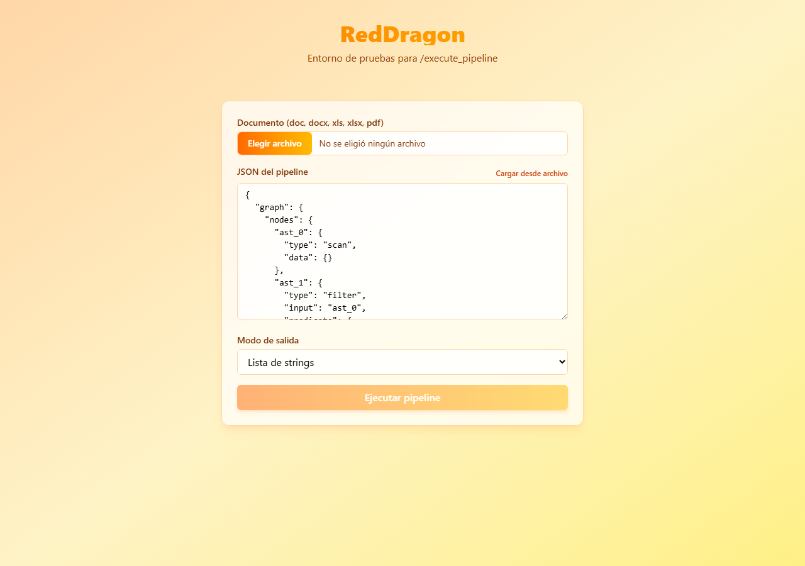
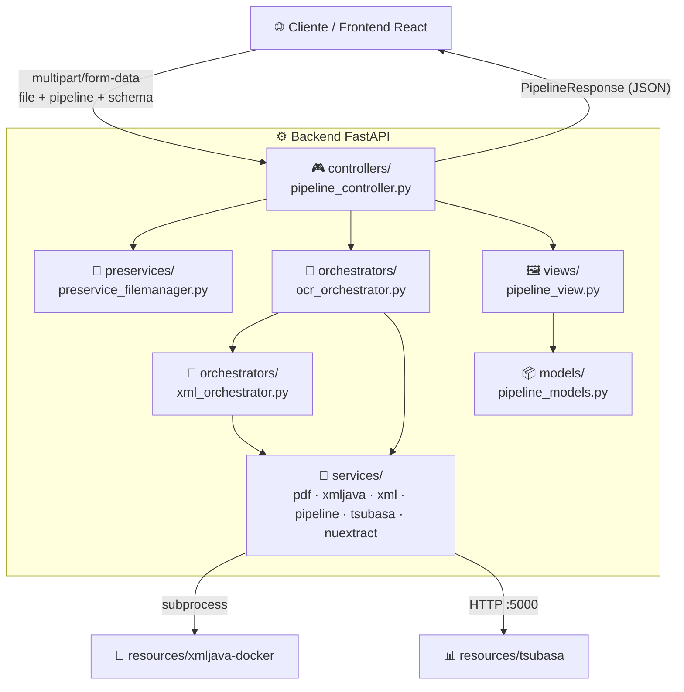
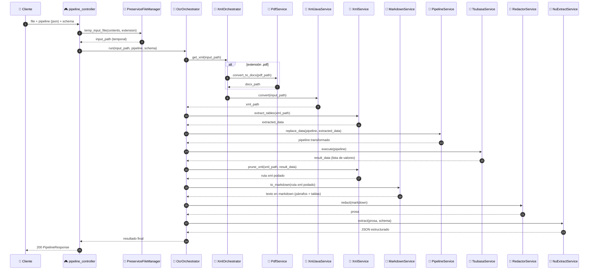

# 🐉 RedDragon

> 🏷️ **Categoría:** Intelligent Document Processing (IDP) platform con motor de pipelines de datos embebido.

**RedDragon es la unión de todo**: es el servicio que **consume** a **[TsubasaEngine](https://github.com/Edahi98/TsubasaEngine)** (el motor de ejecución) y a **[Denki Pipeline Designer](https://github.com/Edahi98/DenkiPepelineDesigner)** (de donde viene la lógica de extracción de documentos) — ambos existen como piezas pensadas para ser integradas por RedDragon, no como alternativas o proyectos paralelos.

Un único endpoint (`POST /execute_pipeline`) recibe un documento (`doc`, `docx`, `xls`, `xlsx`, `pdf`) y un pipeline en JSON, y hace de punta a punta lo siguiente:

1. 📄 **Extracción** — convierte el documento a XML (`xmljava`) y, si hace falta, pasa antes por PDF → DOCX.
2. 🔀 **Inyección de datos** — el contenido extraído reemplaza los nodos `"data"` del pipeline.
3. 🪽 **Ejecución** — el pipeline ya completo corre contra **[Tsubasa](https://github.com/Edahi98/TsubasaEngine)** (Polars + scikit-learn + Bokeh sobre un AST), el mismo motor (`tsubasa.exe`) que arranca Denki.
4. ✂️ **Resultado** — el resultado de Tsubasa se usa para podar el XML original o para filtrar su texto, según el `mode` pedido.

Incluye además un frontend mínimo en **React + Vite + TailwindCSS** para probar ese flujo end-to-end sin necesidad del canvas visual de Denki.



---

## 📐 Arquitectura

RedDragon sigue una **arquitectura en capas estilo MVC**, con dos capas intermedias (`preservices` y `orchestrators`) entre el controller y los services de bajo nivel. Cada capa solo llama hacia abajo, nunca al revés.



### Flujo de `POST /execute_pipeline`



📄 Detalle extendido en [`docs/architecture.md`](docs/architecture.md).

---

## 🗂️ Estructura del proyecto

```
RedDragon/
├── main.py                   # 🚀 bootstrap: FastAPI + lifespan + uvicorn
├── controllers/               # 🎮 rutas HTTP
├── preservices/                # 📁 manejo de archivos temporales
├── orchestrators/               # 🧭 coordinan varios services
├── services/                     # 🔧 lógica atómica (pdf, xml, xmljava, pipeline, tsubasa)
├── models/                        # 📦 schemas Pydantic
├── views/                          # 🖼️ formato de respuesta
├── resources/                       # 📄 binarios (xmljava-docker, tsubasa)
├── models_ai/                        # 🧠 modelos de Hugging Face (no versionado, ver abajo)
├── scripts/start.sh                  # 🐧 arranque nativo en Linux (sin Docker)
├── docs/architecture.md               # 📚 arquitectura detallada
├── frontend/                            # ⚛️ React + Vite + TailwindCSS + Redux Toolkit
│   └── src/
│       ├── components/{atoms,molecules,organisms,templates}/  # 🧩 Atomic Design
│       ├── store/                                                # 🗃️ Redux (slices + persistencia en IndexedDB)
│       ├── hooks/                                                 # 🪝 lógica reutilizable
│       ├── data/                                                   # 📋 listas/config estáticos
│       └── pages/                                                   # 📄 páginas
└── Dockerfile                                                         # 🐳 build multi-etapa
```

---

## ✅ Requisitos

- 🐍 Python ≥ 3.11 + [`uv`](https://docs.astral.sh/uv/)
- 🟢 Node.js + npm (solo para el frontend)
- 🐳 Docker (opcional, recomendado)
- 🐧 Linux (los binarios en `resources/` son ELF; en Windows solo funcionan dentro de Docker/WSL)
- 🧠 Los modelos de IA locales (ver [🧩 Modelo de extracción estructurada](#-modelo-de-extracción-estructurada-nuextract) abajo)

---

## 🔎 Modelo de embeddings (detector de control de cambios)

`services/detector_cambios_service/detector_cambios_encoder.py` usa el modelo **[jina-embeddings-v3](https://huggingface.co/jinaai/jina-embeddings-v3)** vía `sentence-transformers` para vectorizar frases, sobre las que entrena una regresión logística simple. No está versionado en este repo (pesa varios GB) — hay que descargarlo aparte y colocarlo en `models_ai/jina-embeddings-v3`:

```bash
# Opción A: git + git-lfs
git clone https://huggingface.co/jinaai/jina-embeddings-v3 models_ai/jina-embeddings-v3

# Opción B: huggingface-cli
huggingface-cli download jinaai/jina-embeddings-v3 --local-dir models_ai/jina-embeddings-v3
```

---

## 🧩 Modelo de extracción estructurada (NuExtract)

`services/nuextract_service.py` usa **NuExtract-1.5-tiny** (fine-tune de NuMind sobre Qwen2.5-0.5B), en formato **GGUF cuantizado** (`Q8_0`), cargado con **`llama_cpp.Llama`** (no `transformers`). No está versionado en este repo — hay que colocar el archivo en `models_ai/NuExtract-1.5-tiny.Q8_0.gguf` (el nombre debe coincidir exactamente con `GGUF_PATH` en `services/nuextract_service.py`).

> ⚠️ El vocabulario de este `.gguf` corrompe tildes y `ñ` al tokenizar (se reproduce igual con `transformers` y con `llama_cpp`, es un defecto del archivo). `TextNormalizerService.strip_accents` limpia la entrada y la salida del modelo para evitarlo — el resultado pierde el diacrítico original (`Núñez` → `Nunez`).

---

## 🗣️ Modelo de redacción (Qwen)

`services/redactor_service.py` usa **Qwen2.5-0.5B-Instruct**, también en formato **GGUF cuantizado** (`q8_0`), cargado con **`llama_cpp.Llama`**. No está versionado en este repo — hay que colocar el archivo en `models_ai/qwen2.5-0.5b-instruct-q8_0.gguf` (el nombre debe coincidir exactamente con `GGUF_PATH` en `services/redactor_service.py`).

> ⚠️ Mismo defecto de vocabulario que `NuExtract-1.5-tiny.Q8_0.gguf` — ver nota arriba.

---

## ▶️ Cómo levantarlo

### 🐳 Con Docker (recomendado)

```bash
docker build -t reddragon .
docker run -p 8000:8000 -p 5000:5000 reddragon
```

El `Dockerfile` es **multi-etapa**: una etapa `node:22-alpine` compila el frontend (`npm run build`) y la etapa final (Python/uv) copia solo el `dist/` resultante — FastAPI lo sirve como estático en `/`, mientras la API queda en `/execute_pipeline`.

### 🐧 Nativo en Linux (sin Docker)

```bash
bash scripts/start.sh
```

Instala dependencias de Python (`uv sync`) y del frontend, compila el frontend, da permisos de ejecución a los binarios de `resources/` y arranca el servidor.

### 🛠️ Desarrollo (frontend y backend por separado)

```bash
# Backend
uv run main.py

# Frontend (con hot reload, en otra terminal)
cd frontend
npm install
npm run dev
```

---

## ⚙️ Variables de entorno

| Variable | Descripción | Default |
|---|---|---|
| `REDDRAGON_HOST` | Host de uvicorn | `0.0.0.0` |
| `REDDRAGON_PORT` | Puerto de la API | `8000` |
| `REDDRAGON_MAX_PART_MB` | Tamaño máximo (MB) de cada campo de texto del `multipart/form-data` (`pipeline`, `schema`) | `64` |
| `TSUBASA_HOST` | Host del binario `tsubasa` | `127.0.0.1` |
| `TSUBASA_PORT` | Puerto del binario `tsubasa` | `5000` |

---

## 🔌 API

### `POST /execute_pipeline`

`multipart/form-data`:

| Campo | Tipo | Descripción |
|---|---|---|
| `file` | archivo | `doc`, `docx`, `xls`, `xlsx` o `pdf` |
| `pipeline` | string (JSON) | grafo de nodos (`graph.nodes.*`) a ejecutar en Tsubasa. Cada nodo `"data": {}` se reemplaza con `{"dato": [...]}` (columna `"dato"`) — referencia esa columna en tus `select`/`filter`/etc. |
| `schema` | string (JSON) | plantilla de campos a extraer (ej. `{"Nombre": "", "Monto": ""}`). El resultado de Tsubasa se poda contra el XML (`XmlService.prune_xml`), se renderiza en Markdown (`MarkdownService.to_markdown`), se redacta en prosa (`RedactorService.redact`) y `NuExtractService` rellena el esquema contra esa prosa |
| `artifacts` | archivo | ZIP del detector de control de cambios, tal cual lo exporta `POST /train_detector_cambios`. Es la segunda de las tres validaciones que se aplican antes de podar el XML: el pipeline filtra, el detector reconoce las descripciones de cambio y `ChangeScopeService` propaga esa decisión a la tabla del XML que las contiene (así se conservan fecha, revisión y firmantes), y el pipeline se reejecuta sobre lo que sobrevive |

**Respuesta** (`200`):

```json
{
  "filename": "reporte.docx",
  "result": { "Nombre": "...", "Monto": "..." }
}
```

---

## 🔗 Proyectos relacionados

RedDragon es quien **consume** a los dos, no al revés: TsubasaEngine y Denki Pipeline Designer están hechos para ser integrados por RedDragon, que los ensambla dentro de su propio entorno completo — arquitectura en capas (`controllers` → `preservices`/`orchestrators` → `services`), build Docker multi-etapa, script de arranque nativo para Linux y un frontend propio para probarlo.

- 🪽 **[TsubasaEngine](https://github.com/Edahi98/TsubasaEngine)** — el motor de ejecución (`polars_ast`) del que sale el binario `tsubasa`. RedDragon lo consume como una pieza de su arquitectura: lo arranca y gestiona como singleton (`services/tsubasa_service.py`), ligado al ciclo de vida del propio servidor.
- ⚡ **[Denki Pipeline Designer](https://github.com/Edahi98/DenkiPepelineDesigner)** — de aquí sale la lógica de extracción de documentos (`xmljava`, PDF→DOCX) que RedDragon consume en `services/`. Denki la usa dentro de su app de escritorio Electron; RedDragon la integra como parte de su propio backend HTTP.
